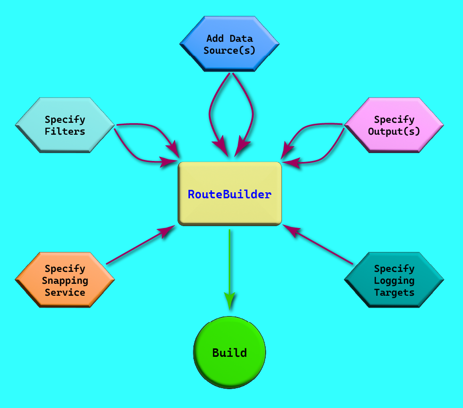

# J4JSoftware.GeoProcessor: Overview

- [Overview](#overview)
- [Snapping Routes](snapping-routes.md)
- [Configuration via Extension Methods](#configuration-via-extension-methods)
  - [Adding Data Sources](adding-data-sources.md)
  - [Specifying Filters](specifying-filters.md)
  - [Specifying Outputs](specifying-outputs.md)
  - [Specifying the Snapping Service](specifying-the-snapping-service.md)
  - [Logging and Messaging](logging-and-messaging.md)

## Overview

You use `GeoProcessor` by configuring an instance of `RouteBuilder` and then building it. Here's a diagram illustrating the overall process:



`RouteBuilder` has only a single public constructor, with a single optional parameter of Microsoft `ILoggerFactory`:

```csharp
public RouteBuilder(
    ILoggerFactory? loggerFactory = null
)
```

[return to top](#j4jsoftwaregeoprocessor-overview)

[return to readme](readme.md)

## Configuration via Extension Methods

You configure `RouteBuilder` by calling various extension methods, which fall into several categories. The extension methods all return the instance of `RouteBuilder` being configured, so you can daisy-chain them in a fluid fashion.

- [Adding Data Sources](adding-data-sources.md)
- [Specifying Filters](specifying-filters.md)
- [Specifying Outputs](specifying-outputs.md)
- [Specifying the Snapping Service](specifying-the-snapping-service.md)
- [Logging and Messaging](logging-and-messaging.md)
