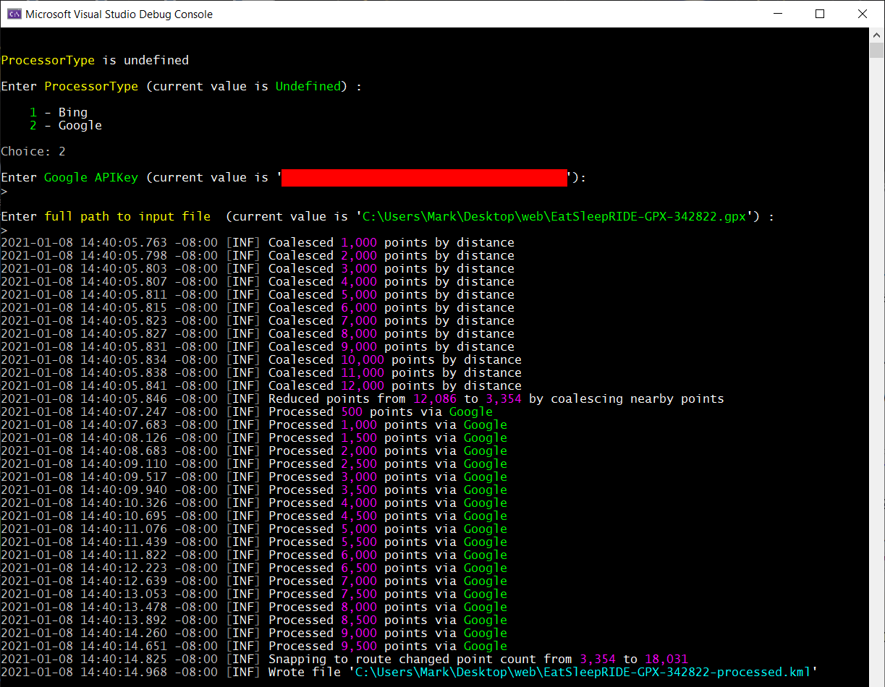

# GeoProcessor
A C# Net5 library and app for processing vehicle geolocation files,
snapping tracks/routes to roadways using the Bing or Google online
snap-to-route processors (**note:** you'll need an account with Bing or Google to
access those).

### TL;DR
The libarary source code should run anywhere Net5 is supported...but 
I've only tested it, and the executable, on Windows 10.



Configuration values can be specified in configuration files or, in some
cases, from the command line. Anything that's required and missing from
the configuration files will be prompted for at the console (you can also
force the app to confirm configuration values through the console).

You will need a Bing or Google API key for the library and program to
work.

### Command line options
|Key        |Explanation|Default|
|-----------|---------------|-----------|
|-i<br/>--inputFile|the input file to process|*none*|
|-n<br/>--defaultName|default name for a route if none is specified in the input file|Unnamed Route|
|-o<br/>--outputFile|the output file to create<br/><br/>file type (e.g., kmz) will be derived from input file extension but can be overriden|*none*|
|-t<br/>--outputType|the type of output file to create. Must be one of *kml* or *kmz*| kml|
|-p<br/>--snapProcessor|the snap-to-route processor to use. Must be one of *Bing* or *Google*| Undefined |
|-r<br/>--runInteractive|force entry of all command line parameters regardless of whether or not they're specified in config file| false (not set)|
|-k<br/>--storeApiKey|prompt user for a snap-to-route processor's API key and store it, encrypted, in the app's user configuration| false (not set)|

### Configuration Files
The app has a general configuration file, in its program directory, for
configuring the logging system, specifying how close raw coordinates should
be to each other to be merged, etc. It's a simple JSON file that looks
like this:
```json
{
  "Processors": {
    "Distance": {
      "MaxDistanceMultiplier": 3,
      "MaxPointsPerRequest": -1,
      "MaxSeparation": "100 ft"
    },
    "Bing": {
      "MaxPointsPerRequest": 100,
      "MaxSeparation": "2 km"
    },
    "Google": {
      "MaxPointsPerRequest": 100,
      "MaxSeparation": "2 km"
    }
  },
  "Logging": {
    "EventElements": "None",
    "SourceRootPath": "C:\\Programming\\KMLProcessor\\",
    "Channels": {
      "Debug": {
        "MinimumLevel": "Information"
      },
      "Console": {
        "MinimumLevel": "Information"
      }
    }
  }
}
```
There's also a user configuration file which stores encrypted snap-to-route
API keys, if those are defined by the user (i.e., not simply entered 
each time the program is run). It looks like this:
```json
{
  "APIKeys": {
    "Bing": {
      "EncryptedValue": "CfDJ8DZjcBUs1sNEu98tAdCI1mAkm...omitted for brevity"
    },
    "Google": {
      "EncryptedValue": "CfDJ8DZjcBUs1sNEu98tAdCI1mCS2...omitted for brevity"
    }
  }
}
```
On Windows it's located at <br/>
*C:\Users\\[username]\AppData\Local\J4JSoftware\GeoProcessor*.


