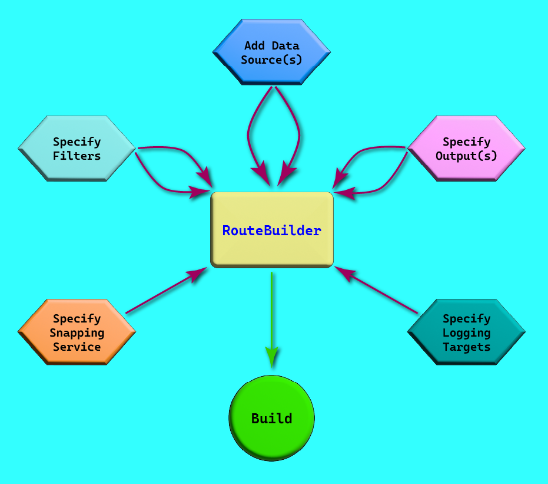

# J4JSoftware.GeoProcessor: Overview

`GeoProcessor` is a Net 7 library for using online route snapping services to snap imported geolocation (GPS) data to roads.

It has nullability enabled.

It is copyright 2023 Mark A. Olbert and licensed under the GPL v3.

- [Overview](#overview)
- [Snapping Routes](snapping-routes.md)
- [Configuration via Extension Methods](#configuration-via-extension-methods)
  - [Adding Data Sources](adding-data-sources.md)
  - [Specifying Filters](specifying-filters.md)
  - [Specifying Outputs](specifying-outputs.md)
  - [Specifying the Snapping Service](specifying-the-snapping-service.md)
  - [Logging and Messaging](logging-and-messaging.md)
- [Example](example.md)

## Overview

You use `GeoProcessor` by configuring an instance of `RouteBuilder` and then building it. Here's a diagram illustrating the overall process:



`RouteBuilder` has only a single public constructor, with a single optional parameter of Microsoft `ILoggerFactory`:

```csharp
public RouteBuilder(
    ILoggerFactory? loggerFactory = null
)
```

[return to top](#j4jsoftwaregeoprocessor-overview)

## Configuration via Extension Methods

You configure `RouteBuilder` by calling various extension methods, which fall into several categories. The extension methods all return the instance of `RouteBuilder` being configured, so you can daisy-chain them in a fluid fashion.

- [Adding Data Sources](adding-data-sources.md)
- [Specifying Filters](specifying-filters.md)
- [Specifying Outputs](specifying-outputs.md)
- [Specifying the Snapping Service](specifying-the-snapping-service.md)
- [Logging and Messaging](logging-and-messaging.md)

[return to top](#j4jsoftwaregeoprocessor-overview)
