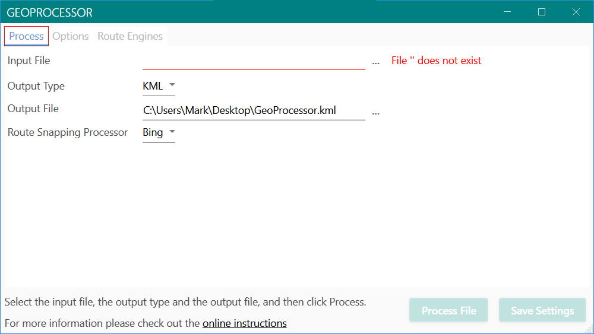
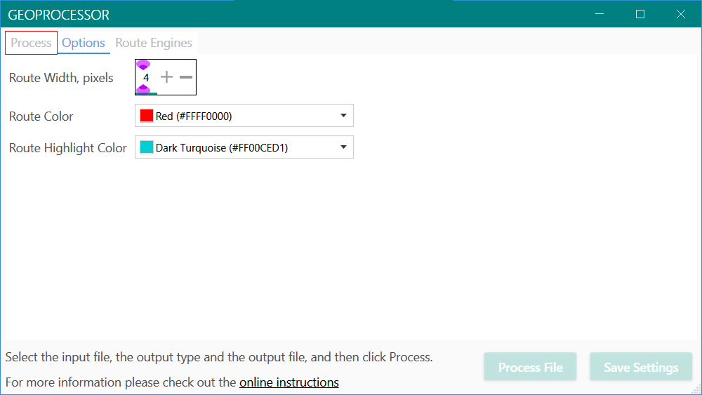
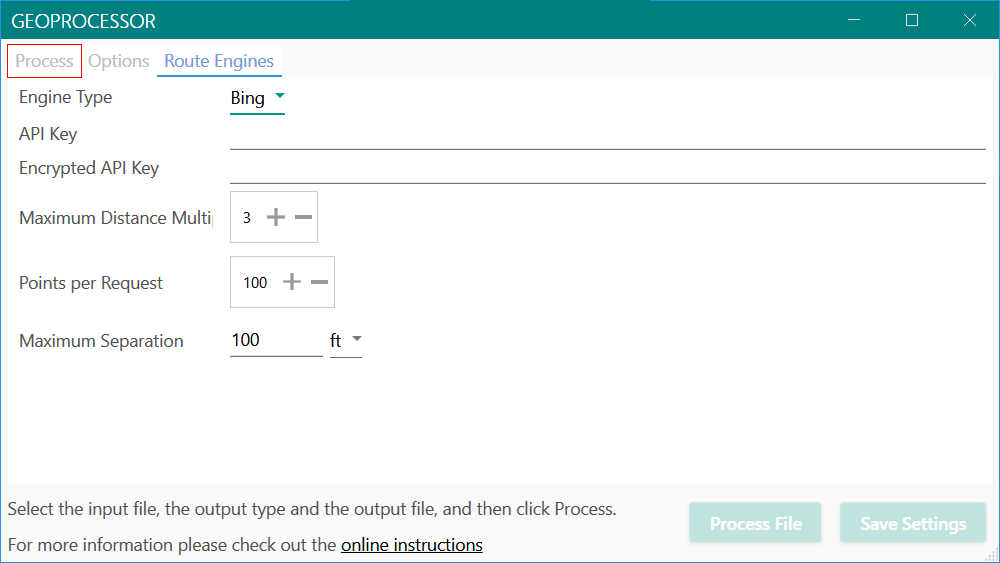
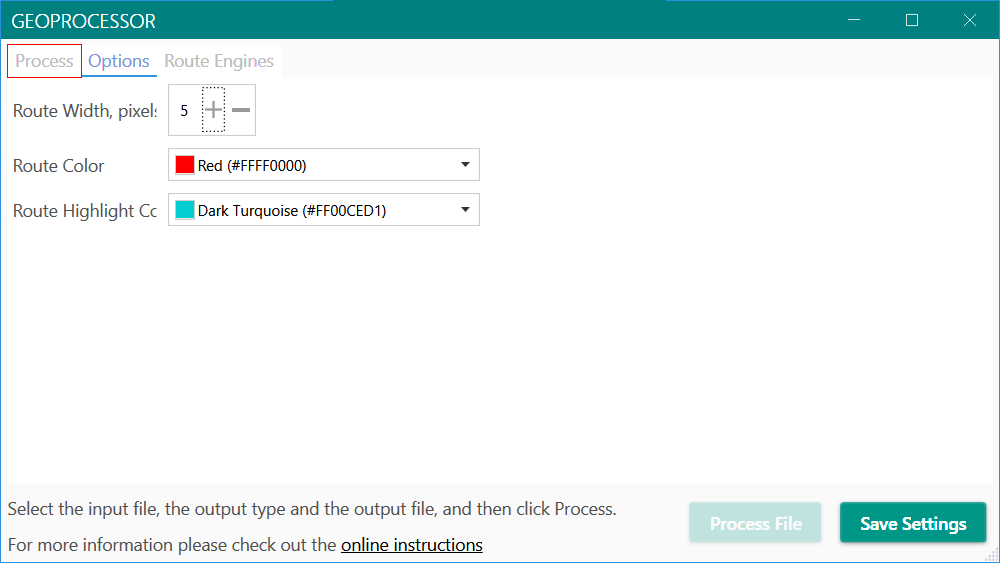

## Configuring the Windows Desktop App
When you launch the app you'll be created with the main window:

By selecting tabs and entering values you can configure how files will be processed. You
can also specify a file to be processed and where you want the processed file to be
saved.

If you haven't configured any snap-to-route processors (e.g., Bing Maps or Google Maps)
you'll have to do that on the **Route Engines** tab.

You can adjust the color and width of the route line that will show up when the route is
displayed in Google Earth on the **Options** tab:

You configure way the various route engines work on the **Route Engines** tab:

I've blanked out the **API Key** and **Encrypted API Key** fields for security reasons. 

Once you have an API key for either Bing Maps or Google Maps you'd enter it in the 
**API Key** field. The **Encrypted API Key** field merely shows the encrypted value of the
key which can be stored in the app's configuration files for later use.

The **Distance** route engine doesn't require an API key because it's internal to the
app. It's used to "coalesce" points that are near each other before sending them off to
the snap-to-route engine. That reduces the number of requests the snap-to-route engine
has to process, which is useful because both Bing and Google start charging you for the
service if you exceed their free usage thresholds.

#### Saving a Configuration
If you change the configuration that's on file the **Save Settings** button will become
enabled:

Clicking it saves your current settings to disk for later use.
