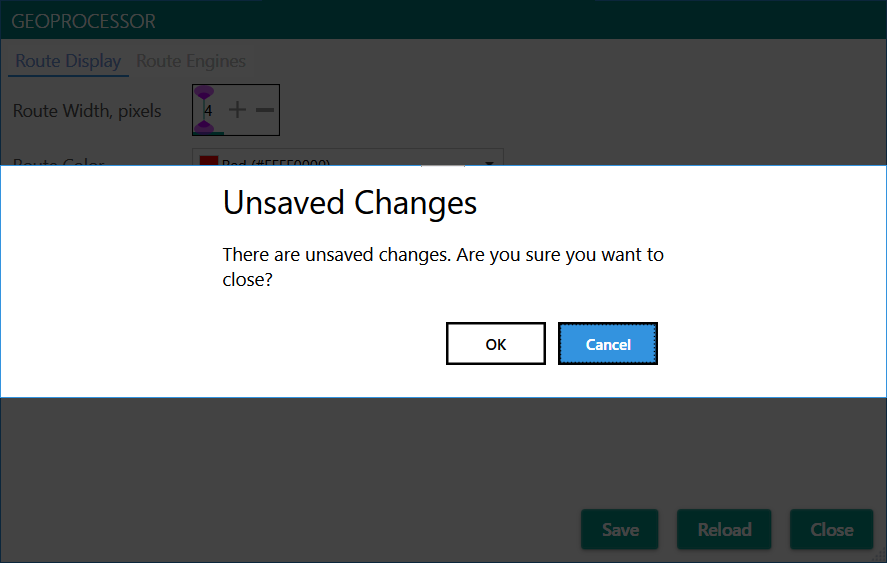

## Configuring the Windows Desktop App
When you launch the app you'll be created with the main window:

You configure how files will be processed by clicking the **Options** button. If 
you haven't configured any snap-to-route processors (e.g., Bing Maps or Google Maps)
you'll have to do that on the **Route Engines** tab of the **Options** window.

The first page of the **Options** window lets you adjust the color and width of 
the route line that will show up when the route is displayed in Google Earth:

You configure way the various route engines work on the **Route Engines** tab:

I've blanked out the **API Key** and **Encrypted API Key** fields for security reasons. 

Once you have an API key for either Bing Maps or Google Maps you'd enter it in the 
**API Key** field. The **Encrypted API Key** field merely shows the encrypted value of the
key which can be stored in the app's configuration files for later use.

The **Distance** route engine doesn't require an API key because it's internal to the
app. It's used to "coalesce" points that are near each other before sending them off to
the snap-to-route engine. That reduces the number of requests the snap-to-route engine
has to process, which is useful because both Bing and Google start charging you for the
service if you exceed their free usage thresholds.

*If you have unsaved changes, clicking **Close** will warn you:*

*If you ignore the warning your changes will be in effect for the current session.*

#### Saving a Configuration
If you change the configuration that's on file the **Save** and **Reload** buttons 
will become enabled:

Clicking **Save** stores your current settings to disk for later use. Clicking
**Reload** reverts the settings to whatever they were when you last saved them.
