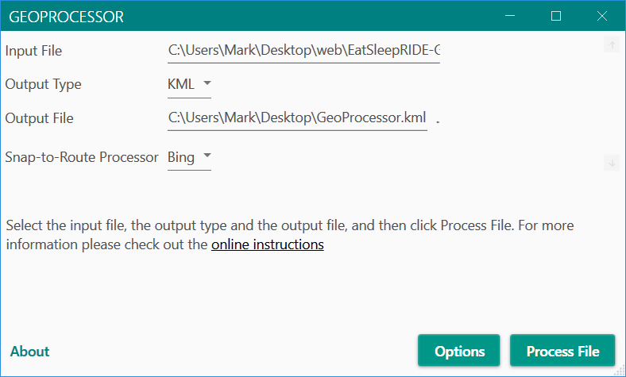
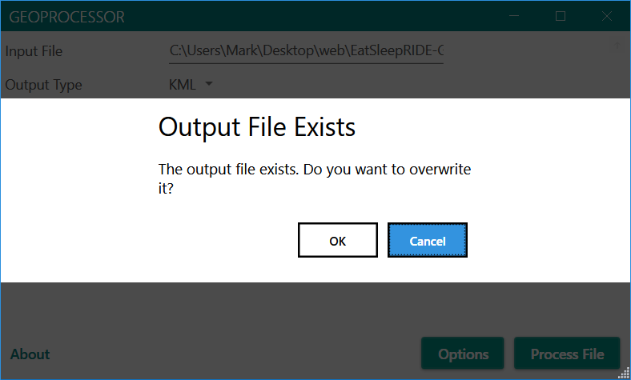
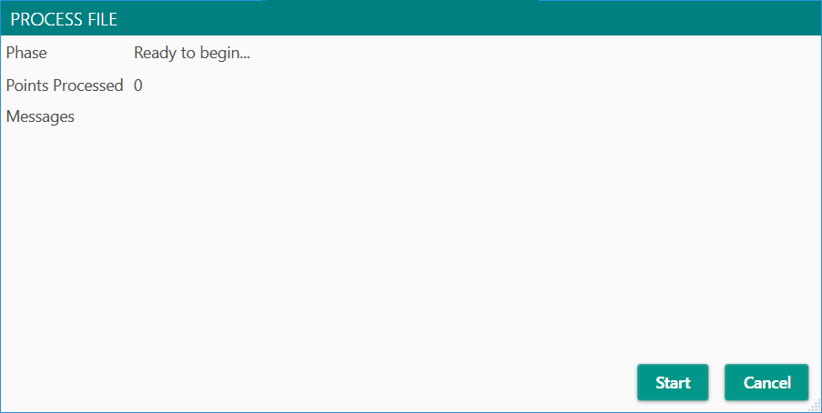
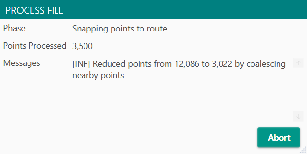
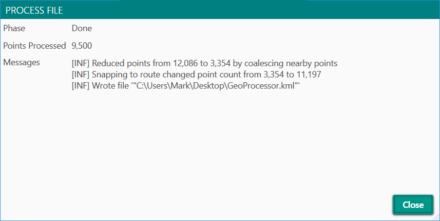

## Running the Windows Desktop App
After you've [properly configured](win-config.md) the app you can select a file to process
by clicking the **...** control to the right of the **Input File** field. This will display
a normal Windows file selection dialog which you can use to choose a file to process. 
The app only knows how to process **GPX**, **KML** and **KMZ** files. 

The app can output its results to either a **KML** or **KMZ** file. **KMZ** files are simply
compressed/zipped **KML** files, so they're smaller but you can't examine them in a text
editor.

After you select a file the **Process File** button becomes enabled:

If the output file exists you'll be asked to confirm you want to overwrite it:

Assuming you do, or if it doesn't already exist, a new window will open:

Clicking the start button begins the conversion. During that process a count of points
processed and various messages will apepar:

During processing you can abort the effort by clicking the **Abort** button. It may take a
second or two for the processing to shut down.

If the process succeeds you'll see a screen like this:

Don't be surprised if the **Points Processed** doesn't match the number of points written
to the output file. That's normal, because the snap-to-route processor adds additional 
points to make the final route "smooth" and match (mostly) actual roads.

Clicking close will take you back to the main window where you can process another file
if you wish.
